# MultiCoder: Your Multi-Agent Collaborative Coding Assistant

**MultiCoder is a multi-agent collaborative code editor based on Cline. It leverages a team of AI agents, including a Planner, a Coder, and a Tester, to autonomously understand requirements, write code, and verify the results.**

## 🤖 How it Works

MultiCoder introduces a structured, multi-agent workflow to tackle development tasks. The process is orchestrated by a central **Planner Agent**:

1.  **Analyze & Plan:** The Planner Agent receives a user's request, analyzes the requirements, and breaks the task down into a detailed plan.
2.  **Delegate:** It then delegates specific coding tasks to a dedicated **Coder Agent** and testing tasks to a **Tester Agent**.
3.  **Execute & Report:** The Coder and Tester agents work on their assigned tasks and report their progress and results back to the Planner.
4.  **Synthesize & Complete:** The Planner oversees the entire process, synthesizes the results, and presents the final solution to the user.

This collaborative approach allows MultiCoder to handle complex, multi-step tasks with greater accuracy and efficiency.

### Workflow

```mermaid
%%{init: { "themeVariables": { "fontSize": "16px" }, "dagre": { "ranksep": 35 } } }%%
graph TD
    User["用户"] --> Planner_Start["Planner: 接收/分析请求"];

    Planner_Start --> Planner_Plan["Planner: 更新 .agent/plan"];
    Planner_Plan --> Planner_Decide{"Planner: 决定行动"};

    Planner_Decide -- 需要澄清? --> Planner_Ask["Planner: ask_followup_question"];
    Planner_Ask --> User;

    Planner_Decide -- 分配编码任务 --> Planner_DelegateCoder["Planner: create_coder_agent / communicate_with_agent(Coder)"];
    Planner_DelegateCoder --> Planner_WaitCoder["Planner: attempt_completion (等待Coder)"];
    Planner_WaitCoder -- 任务 --> Coder_Work;

    subgraph Coder Agent Process
        Coder_Work["Coder: 执行代码 (使用工具)"] --> Coder_Report["Coder: communicate_with_agent(Planner)"];
        Coder_Report --> Coder_End["Coder: attempt_completion (子任务完成)"];
    end
    Coder_Report -- 报告 --> Planner_Decide
    %% Planner继续处理或决定下一步

    Planner_Decide -- 分配测试任务 --> Planner_DelegateTester["Planner: communicate_with_agent(Tester)"];
    Planner_DelegateTester --> Planner_WaitTester["Planner: attempt_completion (等待Tester)"];
    Planner_WaitTester -- 任务 --> Tester_Work;

    subgraph Tester Agent Process
        Tester_Work["Tester: 执行测试 (使用工具)"] --> Tester_Report["Tester: communicate_with_agent(Planner)"];
        Tester_Report --> Tester_End["Tester: attempt_completion (子任务完成)"];
    end
    Tester_Report -- 报告 --> Planner_Decide
    %% Planner继续处理或决定下一步

    Planner_Decide -- 所有任务完成 --> Planner_FinalReport["Planner: attempt_completion (向用户报告)"];
    Planner_FinalReport --> End(("结束/等待新请求"));

    %% Styling
    classDef user fill:#E0BBE4,stroke:#333,stroke-width:2px;
    classDef planner_main fill:#957DAD,stroke:#333,stroke-width:2px,color:white;
    classDef planner_action fill:#C7CEEA,stroke:#333,stroke-width:1px;
    classDef planner_wait fill:#FFFACD,stroke:#BDB76B,stroke-width:1px;
    classDef coder_node fill:#D291BC,stroke:#333,stroke-width:2px;
    classDef tester_node fill:#FEC8D8,stroke:#333,stroke-width:2px;
    classDef decision fill:#A9DFBF,stroke:#333,stroke-width:2px;
    classDef end_node fill:#D3D3D3,stroke:#333,stroke-width:1px;


    class User user
    class Planner_Decide decision
    class Planner_Start,Planner_Plan,Planner_Ask,Planner_DelegateCoder,Planner_DelegateTester,Planner_FinalReport planner_action
    class Planner_WaitCoder,Planner_WaitTester planner_wait
    class Coder_Work,Coder_Report,Coder_End coder_node
    class Tester_Work,Tester_Report,Tester_End tester_node
    class End end_node
```

## ✨ Features

*   **Multi-Agent Architecture:** Utilizes specialized agents (Planner, Coder, Tester) for a clear separation of concerns and more robust task execution.
*   **Automated Task Decomposition:** The Planner agent can break down high-level user requests into concrete, actionable steps.
*   **Intelligent Tool Usage:** Agents are equipped with a variety of tools to interact with the file system, run terminal commands, and search for information.
*   **Extensible and Configurable:** Built on the solid foundation of Cline, allowing for extensive configuration and the addition of new capabilities.
*   **Interactive Workflow:** While the agents work autonomously, you are always in control and can provide feedback or clarification when needed.

## 🚀 Getting Started

*Installation and setup instructions will go here. For now, this is based on the original Cline extension.*

1.  Install the **MultiCoder** extension from the VS Code Marketplace (link to be added).
2.  Open the MultiCoder sidebar in VS Code.
3.  Start your first task by describing what you want to achieve.

## ⚙️ Configuration

You can configure MultiCoder's behavior through the VS Code settings. Many options are inherited from Cline:

*   `cline.preferredLanguage`: Set the language for communication with the agent.
*   `cline.enableCheckpoints`: Enable or disable workspace checkpoints (uses `git`).
*   `cline.disableBrowserTool`: Disable the browser tool.
*   And more...

Check the extension settings in VS Code for a full list of configurable options.

## 🤝 Contributing

Contributions are welcome! If you have ideas for new features or improvements, please open an issue or submit a pull request on our [GitHub repository](https://github.com/cline/cline).

## 🙏 Acknowledgements

MultiCoder is proudly based on the [Cline](https://github.com/cline/cline) project. We extend our heartfelt gratitude to the original developers for their foundational work and for making it available to the community under the Apache-2.0 License.

## 📄 License

This project is licensed under the Apache-2.0 License. See the [LICENSE](LICENSE) file for details.
