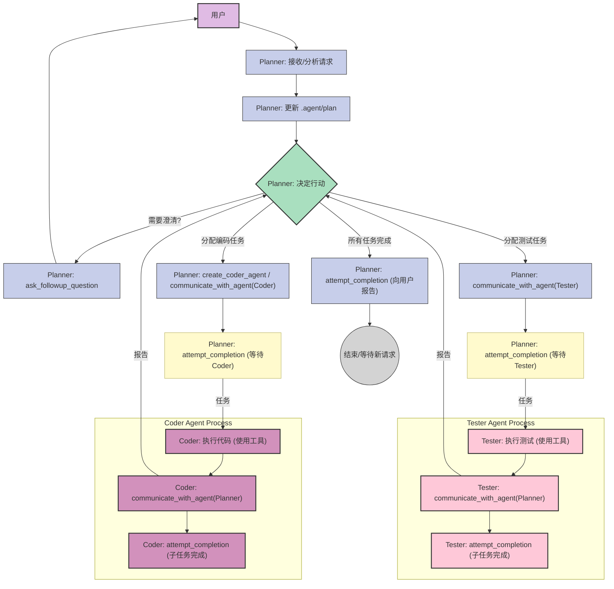

```mermaid
%%{init: { "themeVariables": { "fontSize": "16px" }, "dagre": { "ranksep": 35 } } }%%
graph TD
    User["用户"] --> Planner_Start["Planner: 接收/分析请求"];

    Planner_Start --> Planner_Plan["Planner: 更新 .agent/plan"];
    Planner_Plan --> Planner_Decide{"Planner: 决定行动"};

    Planner_Decide -- 需要澄清? --> Planner_Ask["Planner: ask_followup_question"];
    Planner_Ask --> User;

    Planner_Decide -- 分配编码任务 --> Planner_DelegateCoder["Planner: create_coder_agent / communicate_with_agent(Coder)"];
    Planner_DelegateCoder --> Planner_WaitCoder["Planner: attempt_completion (等待Coder)"];
    Planner_WaitCoder -- 任务 --> Coder_Work;

    subgraph Coder Agent Process
        Coder_Work["Coder: 执行代码 (使用工具)"] --> Coder_Report["Coder: communicate_with_agent(Planner)"];
        Coder_Report --> Coder_End["Coder: attempt_completion (子任务完成)"];
    end
    Coder_Report -- 报告 --> Planner_Decide
    %% Planner继续处理或决定下一步

    Planner_Decide -- 分配测试任务 --> Planner_DelegateTester["Planner: communicate_with_agent(Tester)"];
    Planner_DelegateTester --> Planner_WaitTester["Planner: attempt_completion (等待Tester)"];
    Planner_WaitTester -- 任务 --> Tester_Work;

    subgraph Tester Agent Process
        Tester_Work["Tester: 执行测试 (使用工具)"] --> Tester_Report["Tester: communicate_with_agent(Planner)"];
        Tester_Report --> Tester_End["Tester: attempt_completion (子任务完成)"];
    end
    Tester_Report -- 报告 --> Planner_Decide
    %% Planner继续处理或决定下一步

    Planner_Decide -- 所有任务完成 --> Planner_FinalReport["Planner: attempt_completion (向用户报告)"];
    Planner_FinalReport --> End(("结束/等待新请求"));

    %% Styling
    classDef user fill:#E0BBE4,stroke:#333,stroke-width:2px;
    classDef planner_main fill:#957DAD,stroke:#333,stroke-width:2px,color:white;
    classDef planner_action fill:#C7CEEA,stroke:#333,stroke-width:1px;
    classDef planner_wait fill:#FFFACD,stroke:#BDB76B,stroke-width:1px;
    classDef coder_node fill:#D291BC,stroke:#333,stroke-width:2px;
    classDef tester_node fill:#FEC8D8,stroke:#333,stroke-width:2px;
    classDef decision fill:#A9DFBF,stroke:#333,stroke-width:2px;
    classDef end_node fill:#D3D3D3,stroke:#333,stroke-width:1px;


    class User user
    class Planner_Decide decision
    class Planner_Start,Planner_Plan,Planner_Ask,Planner_DelegateCoder,Planner_DelegateTester,Planner_FinalReport planner_action
    class Planner_WaitCoder,Planner_WaitTester planner_wait
    class Coder_Work,Coder_Report,Coder_End coder_node
    class Tester_Work,Tester_Report,Tester_End tester_node
    class End end_node
```